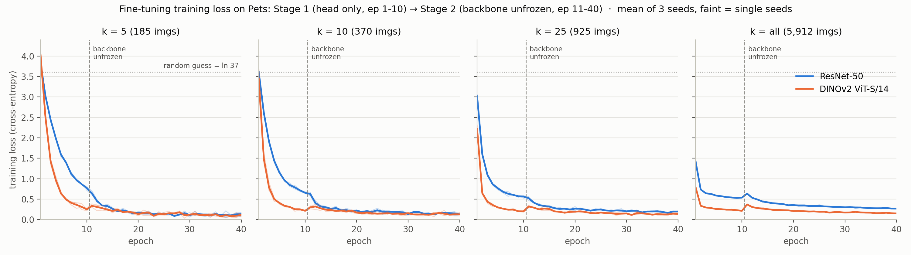

# Zam's Part, Explained From Zero: Phase 2 Fine-Tuning

> Written for: Zam, 2 days before the final.
> Level: you know high-school math (functions, exponents, logs, a bit of vectors). No deep learning background needed.
> Everything here is checked against the real code in this repo (`src/finetune.py`, `config/finetune_recipe.yaml`, `results/finetune_grid.csv`, `runs/`).
> Section 9 contains a **bug I found in `finetune.py` while auditing**. Read it before the final, because a sharp examiner could ask about it.

---

## Table of contents

0. [The 30-second version (memorize this)](#0-the-30-second-version-memorize-this)
1. [The project and where you fit](#1-the-project-and-where-you-fit)
2. [Deep learning crash course (the math you need)](#2-deep-learning-crash-course-the-math-you-need)
3. [Model 1: ResNet-50, every layer and weight](#3-model-1-resnet-50-every-layer-and-weight)
4. [Model 2: DINOv2 ViT-S/14, every layer and weight](#4-model-2-dinov2-vit-s14-every-layer-and-weight)
5. [The data: Oxford Pets and the k-shot splits](#5-the-data-oxford-pets-and-the-k-shot-splits)
6. [Walking through `finetune.py` line by line](#6-walking-through-finetunepy-line-by-line)
7. [Every hyperparameter: what it is, its value, and why](#7-every-hyperparameter-what-it-is-its-value-and-why)
8. [Your results, and how to read them](#8-your-results-and-how-to-read-them)
9. [The audit: what the loss curves say, plus a bug](#9-the-audit-what-the-loss-curves-say-plus-a-bug)
10. [Why fine-tuning loses to the Linear Probe](#10-why-fine-tuning-loses-to-the-linear-probe)
11. [Your other tasks: `run_finetune.sh`, the split check, the benchmark log](#11-your-other-tasks)
12. [Q&A practice: questions you will probably get](#12-qa-practice-questions-you-will-probably-get)
13. [Glossary](#13-glossary)
14. [Numbers card (last-minute review)](#14-numbers-card-last-minute-review)

---

## 0. The 30-second version (memorize this)

> "I did Phase 2, fine-tuning. I took two pretrained models, **ResNet-50** (supervised, ImageNet labels) and **DINOv2 ViT-S/14** (self-supervised, no labels), and adapted them to 37 cat and dog breeds in Oxford Pets. I used a **two-stage recipe**. Stage 1 freezes the backbone and trains only a new classifier head for 10 epochs. Stage 2 unfreezes and trains end-to-end for 30 epochs with a small backbone learning rate, using AdamW and mixed precision. I ran **2 backbones × 4 label budgets (k = 5, 10, 25, all images per class) × 3 seeds = 24 runs**. The main finding: **fine-tuning never beat a simple Linear Probe** on frozen features, but the gap shrinks as we add labels, from about −6 points at k=5 to about −1 or −2 at k=all. DINOv2 fine-tuned beats ResNet fine-tuned at every k, and **DINOv2 frozen + Linear Probe beats ResNet fine-tuned at every k**."

---

## 1. The project and where you fit

### The question the whole team is answering

"If I only have a **few labeled pictures**, which pretrained model should I use, and should I fine-tune it or leave it frozen?"

Three research questions (RQ):

| RQ | Question | Who answers it |
|---|---|---|
| RQ1 | Are DINOv2 frozen features better than ResNet-50 frozen features with few labels? | Phase 1 (frozen grid) |
| **RQ2** | **How much does fine-tuning help compared to frozen features, and at what label budget does it start to pay off?** | **You (Phase 2)** + Phase 1 |
| RQ3 | Does the answer hold on satellite images (EuroSAT)? | Phase 1 |

### The pipeline

```
1. Download data      (Thu)        src/download_data.py
2. Make k-shot splits (Thu)        src/sampler.py
3. Extract features   (Thu)        src/features.py         ┐
4. Frozen evaluation  (Duc et al.) kNN + Linear Probe      ┘ Phase 1: model frozen
5. FINE-TUNING        (YOU, Zam)   src/finetune.py           Phase 2: model trains
6. Master table, plots             scripts/build_master_table.py, make_plots.py
```

### "Frozen" vs "fine-tuned": the core idea

Think of a pretrained model as a person who has already studied millions of photos.

- **Frozen (Phase 1)**: you don't change their brain. You ask them to describe each photo as a list of numbers (a **feature vector**), then train a tiny, simple classifier on those numbers. It's cheap and fast, and it can't damage what they already know.
- **Fine-tuned (Phase 2, you)**: you let their brain change. You keep training the whole network on your pet photos so it can specialize. It's more powerful in theory, but with very few photos it can **overfit** (memorize instead of learn), and it costs a GPU and hours.

Your job was to measure how much fine-tuning gives you on top of frozen features. The surprising answer in this project: **nothing, at any budget we tried.** Fine-tuning was always a bit worse.

---

## 2. Deep learning crash course (the math you need)

### 2.1 An image is just numbers

A color image of size 224×224 is three grids (Red, Green, Blue) of 224×224 numbers each, so 3 × 224 × 224 = **150,528 numbers**. Each one starts in 0–255, then `ToTensor()` divides by 255 to put it in [0, 1].

**Normalization**: we then do `(x − mean) / std` per color channel with
`mean = [0.485, 0.456, 0.406]` and `std = [0.229, 0.224, 0.225]`.
These are the average and spread of the pixels in ImageNet. Both models were trained on images normalized this way, so we must feed them the same thing. That's like using the same units (meters, not feet) the model learned with.

### 2.2 A neuron and a linear layer

One neuron computes a **weighted sum plus a bias**:

$$ y = w_1 x_1 + w_2 x_2 + \dots + w_n x_n + b = \mathbf{w}\cdot\mathbf{x} + b $$

The **w**'s are **weights** and **b** is the **bias**. These are the "parameters", the numbers the model learns.

A **linear layer** (`nn.Linear(in, out)`) is `out` neurons side by side. In matrix form:

$$ \mathbf{y} = W\mathbf{x} + \mathbf{b}, \quad W \text{ has shape } [\text{out}, \text{in}] $$

Number of parameters = `out × in + out`.

**Your classifier head** is exactly this:
- ResNet-50: `nn.Linear(2048, 37)` → 37 × 2048 + 37 = **75,813 parameters**
- DINOv2: `nn.Linear(384, 37)` → 37 × 384 + 37 = **14,245 parameters**

It takes the feature vector (2048 or 384 numbers) and outputs **37 scores**, one per breed. These raw scores are called **logits**.

### 2.3 Non-linearity (ReLU / GELU)

If you only stack linear layers, the whole thing is still just one big linear function, which isn't very smart. So between layers we use a bending function:
- **ReLU** (ResNet): `ReLU(x) = max(0, x)`. Negative values become 0.
- **GELU** (DINOv2): a smooth version of ReLU.

### 2.4 Softmax: turning scores into probabilities

The logits $z_1, \dots, z_{37}$ can be any numbers. Softmax turns them into probabilities that are all positive and sum to 1:

$$ p_i = \frac{e^{z_i}}{\sum_{j=1}^{37} e^{z_j}} $$

Example with 3 classes and logits (2, 1, 0):
$e^2 = 7.39,\ e^1 = 2.72,\ e^0 = 1$, sum = 11.11 → probabilities (0.665, 0.245, 0.090).

The prediction is the class with the highest score (`argmax`).

### 2.5 Cross-entropy loss: how wrong are we?

If the true class is $y$, the loss is

$$ L = -\ln(p_y) $$

- If the model gives the right class probability 1 → $-\ln 1 = 0$ (perfect).
- Probability 0.5 → $-\ln 0.5 = 0.69$.
- Probability 0.01 → $-\ln 0.01 = 4.6$ (terrible).

**Sanity check you can use in Q&A**: a model that guesses randomly among 37 classes gives each class probability 1/37, so its loss is $\ln 37 \approx$ **3.61**. In our TensorBoard logs, the first-epoch loss at small k is **3.2–4.2**, which is right around 3.61. That proves the new head started from random and the loss is computed correctly. (Section 9.)

`nn.CrossEntropyLoss` in PyTorch does softmax and $-\ln$ together, averaged over the batch.

### 2.6 Gradient descent: how learning works

We want to change every weight so the loss goes down. The **gradient** $\frac{\partial L}{\partial w}$ tells you: "if I nudge $w$ up a little, how much does the loss change?" So we step the opposite way:

$$ w \leftarrow w - \eta \cdot \frac{\partial L}{\partial w} $$

$\eta$ (eta) is the **learning rate (lr)**, meaning how big the step is.
- Too big: you overshoot and the loss explodes or jumps around.
- Too small: learning is super slow, or barely changes anything.

**Backpropagation** (`loss.backward()`) is the chain rule from calculus, applied automatically, to compute the gradient for **every** weight in the network at once.

### 2.7 Batches, epochs, steps

- **Batch**: we don't use all images at once. We take 32 at a time (`batch_size = 32`), compute the average loss, and do one update. One update is called a **step**.
- **Epoch**: one full pass over all training images.
- Steps per epoch = ceil(number of images / 32).

### 2.8 Adam and AdamW (the optimizer you used)

Plain gradient descent uses the same step size rule everywhere. **Adam** is smarter. For each weight it keeps:
- $m$ = a running average of recent gradients (**momentum**: "which way have we been going?")
- $v$ = a running average of squared gradients ("how bumpy is this direction?")

and updates

$$ w \leftarrow w - \eta \cdot \frac{m}{\sqrt{v} + \epsilon} $$

Dividing by $\sqrt{v}$ means each weight gets its **own effective step size**. A side effect worth remembering: in the first steps, every weight moves by roughly $\eta$ no matter how small its gradient is. (This matters in Section 9.)

**Weight decay** pulls every weight slightly toward 0 at each step. It's a "don't get too extreme" rule that fights overfitting.

**AdamW** = Adam + weight decay done the "correct, decoupled" way:

$$ w \leftarrow w - \eta \cdot \frac{m}{\sqrt{v}+\epsilon} - \eta \cdot \lambda \cdot w $$

where $\lambda$ is `weight_decay` (0.01 for ResNet, 0.05 for DINOv2). In plain Adam, weight decay gets mixed into the gradient and then divided by $\sqrt{v}$, which weakens it unevenly. AdamW keeps it separate. AdamW is the standard optimizer for Vision Transformers.

### 2.9 Overfitting: the enemy of few-shot learning

At k=5 you have 5 photos × 37 breeds = **185 training images**, and you're training a model with **~23 million parameters**. That's more than 100,000 parameters per image. The model can simply **memorize** the 185 photos (training loss → almost 0) without learning what a "Bengal cat" really looks like. Test accuracy then suffers. Defenses we use:
- **pretraining** (start from a smart model, not random)
- **small backbone learning rate** (don't move the pretrained weights much)
- **weight decay**
- **data augmentation** (2.10)
- **two stages** (2.12)

### 2.10 Data augmentation

Every time an image is used for training, we randomly change it a little so the model never sees the exact same picture twice:
- `RandomResizedCrop(224)`: cut a random piece (between **8% and 100%** of the area by default, aspect ratio 3/4–4/3) and resize it to 224×224
- `RandomHorizontalFlip()`: mirror it left-right with 50% chance
- `ColorJitter(0.2, 0.2, 0.2)`: randomly change brightness, contrast, and saturation by up to ±20%

The test images get **no** randomness: `Resize(256) → CenterCrop(224)`, the same every time, so the test is fair and repeatable.

### 2.11 Transfer learning

Training a 23M-parameter model from scratch needs millions of images. Instead we **transfer**: we take a model already trained on a huge dataset and reuse its "vision skills". The early layers detect edges and colors, the middle layers textures and parts (fur, ears, eyes), and the late layers whole objects. Those skills are useful for pets too.

### 2.12 Frozen vs Linear Probe vs kNN vs Fine-tune vs two-stage

| Method | What trains | Phase |
|---|---|---|
| **kNN** | Nothing. For a test image, find the 20 most similar training images (cosine similarity of features) and take a majority vote | 1 |
| **Linear Probe (LP)** | Only a linear classifier (logistic regression) on top of **fixed** features | 1 |
| **Fine-tune (FT)** | Everything: backbone + head | 2 (you) |
| **Two-stage FT (yours)** | Stage 1 = head only (like a linear probe), Stage 2 = everything | 2 (you) |

Why two stages? If you put a **random** head on a pretrained backbone and train everything at once, the random head sends large, garbage gradients back into the backbone during the first steps and can **wreck the good pretrained features**. Training the head first (Stage 1) makes the gradients sensible before the backbone is allowed to move. In research this is called **LP-FT** ("linear probe, then fine-tune"; Kumar et al., ICLR 2022). It's a respected recipe, which is a good thing to say in Q&A.

**Key insight for Q&A**: a Linear Probe *is* a linear layer + softmax + cross-entropy, which is mathematically the same as your Stage 1 head. The difference is how it's trained (more in Section 10).

---

## 3. Model 1: ResNet-50, every layer and weight

### 3.1 What it is

- A **Convolutional Neural Network (CNN)** from 2015 (He et al., Microsoft). "50" = 50 layers with weights.
- Trained **supervised** on **ImageNet-1K**: 1.28 million images with human labels in 1000 classes. ImageNet contains about 120 dog breeds and several cat classes, so ResNet has literally been trained on pet breeds. That's an important point for Q&A.
- Weights used: torchvision **`IMAGENET1K_V1`** (ImageNet top-1 accuracy 76.1%). There is also V2 (80.9%, trained with a stronger recipe). Early on, Phase 1 used V2 by mistake. On 06/10 Thu re-extracted the features with V1, so **both phases now use V1**, a fair comparison.

### 3.2 Convolution in one paragraph

A convolution slides a small filter (e.g. 3×3) over the image. At each position it computes a weighted sum of the pixels under it, the same "weights · inputs + bias" as before, but with the **same** weights reused everywhere. A 3×3 filter on 64 input channels has 3×3×64 = 576 weights. A layer with 64 such filters has 64 × 576 = **36,864** weights. Each filter learns to detect one pattern (an edge, a stripe of fur, an eye shape...). Reusing weights everywhere makes CNNs efficient and good at finding a pattern wherever it appears.

### 3.3 Batch Normalization (BN)

After each convolution, BN re-centers and re-scales each channel:

$$ \hat{x} = \frac{x - \mu_{batch}}{\sqrt{\sigma^2_{batch} + \epsilon}}, \qquad y = \gamma \hat{x} + \beta $$

- $\gamma$ (`bn.weight`) and $\beta$ (`bn.bias`) are **learned parameters** (2 per channel).
- `running_mean` and `running_var` are **buffers**, not parameters. They're not trained by gradients. They're running averages of the batch statistics, updated automatically every time the model runs in `model.train()` mode, and used instead of batch statistics in `model.eval()` mode.

Remember this distinction: it shows up in Section 9.4.

### 3.4 Residual connection: the big idea of ResNet

Each block computes $y = F(x) + x$ instead of $y = F(x)$. The "+ x" is a **shortcut**. The block only needs to learn the *difference* (the residual) from its input. This lets gradients flow straight back through 50 layers without vanishing, which is why very deep networks became trainable.

### 3.5 Architecture with shapes (input 224×224)

| Stage | What | Output shape (channels × H × W) |
|---|---|---|
| Input | RGB image | 3 × 224 × 224 |
| `conv1` | 7×7 conv, 64 filters, stride 2 + BN + ReLU | 64 × 112 × 112 |
| `maxpool` | 3×3 max pool, stride 2 | 64 × 56 × 56 |
| `layer1` | 3 bottleneck blocks | 256 × 56 × 56 |
| `layer2` | 4 bottleneck blocks | 512 × 28 × 28 |
| `layer3` | 6 bottleneck blocks | 1024 × 14 × 14 |
| `layer4` | 3 bottleneck blocks | 2048 × 7 × 7 |
| `avgpool` | average each of the 2048 maps → 1 number | **2048** (the feature vector) |
| `fc` | **your new head** `Linear(2048, 37)` | **37 logits** |

**Bottleneck block** = 1×1 conv (shrink channels) → 3×3 conv (look at neighbors) → 1×1 conv (expand channels ×4), each followed by BN, with ReLU, plus the shortcut. Counting the layers: 1 (conv1) + (3+4+6+3) blocks × 3 convs = 48, + 1 (fc) = **50**.

Example: the first block `layer1.0`:
- `conv1` 1×1, 64→64: 64×64 = 4,096 weights
- `conv2` 3×3, 64→64: 3×3×64×64 = 36,864
- `conv3` 1×1, 64→256: 64×256 = 16,384
- `downsample` (shortcut needs to change 64→256 channels): 1×1 conv, 16,384
- plus BN γ/β for every conv

### 3.6 Parameter count

| Part | Parameters |
|---|---|
| Original ResNet-50 total | 25,557,032 |
| Original `fc` (2048→1000) | 2,049,000 (thrown away) |
| **Backbone (everything except fc)** | **23,508,032** |
| **Your new head `fc` (2048→37)** | **75,813** |
| Your model total | 23,583,845 |

In code (`src/finetune.py:107-109`):
```python
model = models.resnet50(weights=models.ResNet50_Weights.IMAGENET1K_V1)  # load pretrained
model.fc = nn.Linear(model.fc.in_features, num_classes)                 # swap 1000-class head for 37-class head
```
`model.fc.in_features` = 2048. The new `fc` starts **random**, and the rest keeps its ImageNet weights.

---

## 4. Model 2: DINOv2 ViT-S/14, every layer and weight

### 4.1 What it is

- **ViT** = Vision Transformer. Same architecture family as ChatGPT-style language models, but on image pieces instead of words.
- **S** = Small (embedding size 384, 12 layers, 6 attention heads). **/14** = patch size 14×14 pixels.
- **DINOv2** (Meta, 2023) = the *training method*. It's **self-supervised**: it learned from **142 million images with NO labels** (the LVD-142M dataset).
- How can you learn with no labels? **Self-distillation**. A "student" network sees different crops of an image and must produce the same output as a "teacher" network. The teacher is a slowly-moving average (EMA) of the student. It also has a masked-patch task (hide patches, predict their representation). To agree across crops, the network must understand *what's in the image*. The small ViT-S/14 was then **distilled** from the giant DINOv2 ViT-g/14.
- Loaded with `torch.hub.load("facebookresearch/dinov2", "dinov2_vits14")`.

### 4.2 How a ViT reads an image

1. **Cut into patches**: 224 / 14 = 16, so the image becomes 16 × 16 = **256 patches**, each 14×14×3 = 588 numbers.
2. **Patch embedding**: each patch goes through a linear layer (implemented as a 14×14 conv with stride 14) → a vector of 384 numbers = one **token**.
3. **CLS token**: a special learned token is added at the front → **257 tokens**. Its job is to collect a summary of the whole image.
4. **Position embedding**: a learned vector is added to each token so the model knows *where* each patch was. (DINOv2 was trained at 518×518 → 37×37 positions. At 224 input, the position table is interpolated down to 16×16 automatically.)
5. **12 Transformer blocks** (4.3).
6. **Final LayerNorm**, then take the **CLS token** → the **384-number feature vector**.
7. **Your head** `Linear(384, 37)` → 37 logits.

In code (`src/finetune.py:94-102`):
```python
class DINOv2Classifier(nn.Module):
    def __init__(self, backbone, num_classes=37):
        self.backbone = backbone                 # DINOv2: image -> 384-d CLS feature
        self.head = nn.Linear(384, num_classes)  # your new head
    def forward(self, x):
        return self.head(self.backbone(x))
```

### 4.3 One Transformer block

```
x = x + LayerScale1( Attention( LayerNorm1(x) ) )
x = x + LayerScale2(    MLP   ( LayerNorm2(x) ) )
```
Notice the **"x +"**: residual connections again, same idea as ResNet.

**Self-attention**, the heart of it. Every token creates three vectors: a **Query** (what am I looking for?), a **Key** (what do I contain?), and a **Value** (what do I give if chosen):

$$ \text{Attention}(Q,K,V) = \text{softmax}\!\left(\frac{QK^\top}{\sqrt{d}}\right)V $$

- $QK^\top$ = how well each token's question matches every other token's key (dot products → similarity).
- Divide by $\sqrt{d}$ ($d$ = 64 per head) to keep the numbers from getting too large.
- softmax → attention weights that sum to 1.
- Multiply by $V$ → each token becomes a weighted mix of the information from all tokens.

So a patch showing an ear can "look at" the patch showing the face. That's **global context from layer 1**, unlike a CNN that only sees neighbors and grows its view slowly.
**6 heads** × 64 dims = 384: six attention patterns run in parallel, each free to focus on different things.

**MLP**: Linear(384→1536) → GELU → Linear(1536→384), applied to each token separately.
**LayerNorm**: like BatchNorm but normalizes across the 384 numbers of *each token* (no batch statistics, **no running buffers**).
**LayerScale**: a learned per-channel multiplier (384 numbers) that starts small, which stabilizes deep training.

### 4.4 Every weight tensor (one block, then totals)

| Weight | Shape | Count |
|---|---|---|
| `patch_embed.proj.weight` / `.bias` | [384, 3, 14, 14] / [384] | 226,176 |
| `cls_token` | [1, 1, 384] | 384 |
| `pos_embed` | [1, 1370, 384] (37×37+1 positions) | 526,080 |
| `mask_token` (only used in pretraining) | [1, 384] | 384 |
| **Per block** (×12): | | |
| `norm1.weight`, `.bias` | [384] ×2 | 768 |
| `attn.qkv.weight`, `.bias` (Q, K, V stacked) | [1152, 384], [1152] | 443,520 |
| `attn.proj.weight`, `.bias` | [384, 384], [384] | 147,840 |
| `ls1.gamma` | [384] | 384 |
| `norm2.weight`, `.bias` | [384] ×2 | 768 |
| `mlp.fc1.weight`, `.bias` | [1536, 384], [1536] | 591,360 |
| `mlp.fc2.weight`, `.bias` | [384, 1536], [384] | 590,208 |
| `ls2.gamma` | [384] | 384 |
| *one block total* | | *1,775,232* |
| 12 blocks | | 21,302,784 |
| final `norm` | [384] ×2 | 768 |
| **Backbone total** | | **≈ 22.06 M** |
| **Your head** `head.weight`, `head.bias` | [37, 384], [37] | **14,245** |

### 4.5 ResNet-50 vs DINOv2 side by side

| | ResNet-50 | DINOv2 ViT-S/14 |
|---|---|---|
| Type | CNN | Transformer |
| Pretraining | **Supervised**, ImageNet-1K labels (1.28 M images) | **Self-supervised**, no labels (142 M images) |
| Backbone parameters | 23.5 M | 22.1 M (about the same size, so a fair fight) |
| Feature size | 2048 | 384 |
| Normalization | BatchNorm (has running stats) | LayerNorm (no running stats) |
| Sees globally from | only late layers | layer 1 (attention) |
| Your backbone lr | 1e-4 | **1e-5** (10× smaller) |
| Your weight decay | 0.01 | 0.05 |

---

## 5. The data: Oxford Pets and the k-shot splits

- **Oxford-IIIT Pets**: **37 breeds** (25 dogs, 12 cats). We load the HuggingFace version `pcuenq/oxford-pets` (7,390 images in its `train` split).
- `src/download_data.py` splits it **80/20, stratified, seed 42** → **5,912 trainval** (~160 per breed) and **1,478 test** (~40 per breed). "Stratified" means each breed keeps the same 80/20 ratio. ⚠️ This is **not** the official Pets test split (3,669 images). That's a known limitation.
- Fine-tuning is done **only on Pets** (not EuroSAT). That was the plan's scope, because it needs a GPU.

### k-shot = k images per class

| k | images per breed | total training images | steps per epoch (batch 32) |
|---|---|---|---|
| 5 | 5 | 185 | 6 |
| 10 | 10 | 370 | 12 |
| 25 | 25 | 925 | 29 |
| all | ~160 | 5,912 | 185 |

### How the sampler works (`src/sampler.py`)

```python
rng = random.Random(seed)                     # seeded random generator → same seed, same result
indices_by_label = {label: [all indices of that breed]}
for label in indices_by_label: rng.shuffle(indices_by_label[label])   # shuffle each breed's list
splits[k] = for each breed take idxs[:k]      # first k of the shuffled list
splits["all"] = everything
```

Two properties:
1. **Deterministic**: same seed → same images, always.
2. **Nested**: k=5 is the first 5 of the shuffled list and k=10 the first 10, so **k=5 ⊂ k=10 ⊂ k=25 ⊂ all**. When accuracy changes between k=5 and k=10, it's because of the 5 *extra* images, not a totally different random draw. That makes the curves cleaner.

**Seed meaning in your runs**: seeds 0, 1, 2 select 3 different sets of training images. Phase 1 used 5 seeds (0–4). You used 3 because each fine-tune run costs GPU time (k=all ≈ 22 minutes).

---

## 6. Walking through `finetune.py` line by line

File: [`src/finetune.py`](../src/finetune.py)

> ⚠️ This section describes the **original** `src/finetune.py`, the code that produced all 24 results. There is now also a **fixed copy**, [`src/finetune_fixed.py`](../src/finetune_fixed.py), with every audit fix marked `# FIX #n`. See [Section 9.5](#95-original-vs-fixed-side-by-side).

### Section 1: `load_recipe` (lines 25–41)
Reads `config/finetune_recipe.yaml` into a Python dict. If the file is missing, it falls back to the **same** values hard-coded. Keeping the hyperparameters in a YAML file means they are "locked" and visible to everyone, not hidden in code.

### Section 2: `append_result_to_csv` (lines 45–56)
Appends one row `backbone, dataset, method, k, seed, accuracy` to `results/finetune_grid.csv`, and writes the header if the file is new. It **appends**, never overwrites. So if you run the same config twice you get **duplicate rows**. That's exactly what happened before (the `resnet50/pets/k=5/seed=0` duplicate, 78.28 vs 78.21) and why the clean rerun was needed. It's also why `run_finetune.sh` must delete the CSV first (Section 11).

### Section 3: dataset + transforms (lines 60–90)
- `PetsPyTorchDataset` wraps the HuggingFace dataset so PyTorch can use it. For index `idx` it returns `(image_tensor, label)`. `.convert("RGB")` makes sure every image has 3 channels (some files are grayscale or have transparency).
- `train_transform`: augmentation (Section 2.10) → `ToTensor` → `Normalize`.
- `val_transform`: `Resize(256) → CenterCrop(224)` → `ToTensor` → `Normalize`. This is the **same preprocessing Thu used to extract the frozen features**, so the test images look identical in both phases.

### Section 4: `build_model` (lines 105–115)
Builds the model and returns **three things**: the model, the **head parameters**, and the **backbone parameters**. The split is done by name:
- ResNet: names containing `"fc"` are the head, everything else is the backbone.
- DINOv2: names containing `"head"` are the head.

⚠️ The head parameters are returned as `model.fc.parameters()`, which is a Python **generator**. This causes the bug in Section 9.3.

### Section 5: `cleanup_vram` (lines 119–124)
Frees GPU memory between runs (`gc.collect()`, `torch.cuda.empty_cache()`). Without this, 24 runs back-to-back could run out of VRAM on an 8 GB RTX 4060.

### Section 6: `train_two_stage`, the main engine (lines 128–242)

**Setup (lines 134–163)**
```python
splits = make_kshot_splits(trainval_hf, k_values=[k], seed=seed)  # pick the k-shot images
train_ds = Subset(PetsPyTorchDataset(trainval_hf, train_transform), train_indices)
test_ds  = PetsPyTorchDataset(test_hf, val_transform)             # full 1,478 test images
DataLoader(..., batch_size=32, shuffle=True, num_workers=0, pin_memory=True)
```
- `shuffle=True` for training means a different order each epoch. The test loader doesn't shuffle (order doesn't matter there).
- `num_workers=0` means images are loaded in the main process, which is slower but avoids Windows multiprocessing crashes.
- `pin_memory=True` makes CPU→GPU copies faster.
- `criterion = nn.CrossEntropyLoss()` is the loss from Section 2.5.
- `scaler = GradScaler` is for mixed precision (Section 7.6).
- `SummaryWriter("runs/{model}_k{k}_seed{seed}")` writes TensorBoard logs.

**Stage 1: head only (lines 166–185)**
```python
for p in backbone_params: p.requires_grad = False   # freeze backbone: no gradients computed
opt1 = AdamW(head_params, lr=lr_head, weight_decay=wd)   # optimizer only knows the head
for epoch in range(10):
    model.train()
    for imgs, lbls in train_loader:
        opt1.zero_grad()                         # clear old gradients
        with autocast('cuda'):                   # mixed precision forward pass
            loss = criterion(model(imgs), lbls)
        scaler.scale(loss).backward()            # backprop (only reaches the head)
        scaler.step(opt1)                        # update the head
        scaler.update()
```
`requires_grad = False` tells PyTorch "don't compute gradients for these", which saves memory and time and keeps them fixed.

**Stage 2: unfreeze (lines 188–211)**
```python
for p in backbone_params: p.requires_grad = True
opt2 = AdamW([
    {'params': backbone_params, 'lr': lr_backbone},   # small lr for pretrained weights
    {'params': head_params,     'lr': lr_head},       # bigger lr for the head (intended)
], weight_decay=wd)
for epoch in range(30): ... same loop with opt2 ...
```
These are **"parameter groups"**: one optimizer, two learning rates. The idea is good (the pretrained part moves gently, the new part moves fast). But see Section 9.3: the head group ends up **empty**.

**Evaluation (lines 214–224)**
```python
model.eval()                      # BN uses running stats, no randomness
with torch.no_grad():             # no gradients needed → faster, less memory
    preds = model(imgs).argmax(dim=1)
acc = correct / total * 100
```
Top-1 accuracy = % of the 1,478 test images where the highest-scoring breed is the correct one. It's evaluated **once, after the last epoch**. There's no early stopping and no checkpoint picking, so the test set never influenced any choice. That's honest, and a good Q&A point. (The comment on line 213 says "official test set", but it's actually our 20% split.)

### Section 7: `run_full_grid` (lines 246–263)
Three nested loops: `backbones × k_values × seeds` = 2 × 4 × 3 = **24 runs**. From the TensorBoard timestamps the whole grid took about **2.9 hours** on the RTX 4060 (a k=5 run ≈ 1 minute, a k=all run ≈ 22 minutes).

### Section 8: CLI (lines 267–284)
```bash
python src/finetune.py --grid                              # all 24
python src/finetune.py --backbone dinov2 --k 25 --seed 0   # one run
```
It stops immediately if there's no CUDA GPU (`SystemError`).

---

## 7. Every hyperparameter: what it is, its value, and why

From [`config/finetune_recipe.yaml`](../config/finetune_recipe.yaml):

| Hyperparameter | ResNet-50 | DINOv2 | Meaning |
|---|---|---|---|
| `batch_size` | 32 | 32 | images per update step |
| `lr_head` | 1e-3 (0.001) | 1e-3 | learning rate for the new head |
| `lr_backbone` | 1e-4 (0.0001) | **1e-5** (0.00001) | learning rate for the pretrained part (Stage 2) |
| `weight_decay` | 0.01 | 0.05 | AdamW "pull toward zero" strength |
| `epochs_stage1` | 10 | 10 | head-only epochs |
| `epochs_stage2` | 30 | 30 | full fine-tune epochs |

### 7.1 `lr_head = 1e-3`
The head starts random, so it needs to move a lot, and 1e-3 is the standard Adam default. It has only 14k–76k parameters, so it can't do much damage.

### 7.2 `lr_backbone`: 1e-4 (ResNet) vs 1e-5 (DINOv2)
The backbone already knows a lot, so we want to **nudge** it, not rewrite it. That's why it's 10× (ResNet) or 100× (DINOv2) smaller than the head lr.
**Why is DINOv2 10× smaller than ResNet?** Transformers are known to be more sensitive to large updates during fine-tuning (no BatchNorm to re-stabilize activations, attention softmax can saturate), and DINOv2's self-supervised features are general-purpose and easy to "destroy" by pushing them hard toward 37 classes. Common practice for ViT fine-tuning uses lr around 1e-5 for the backbone.

### 7.3 `weight_decay`: 0.01 vs 0.05
Weight decay of 0.05 is the standard value in ViT/DeiT/DINO training recipes, and 0.01 is a common value for CNNs with AdamW. Each model gets "its usual" value.

### 7.4 `batch_size = 32`
Small enough to fit on an 8 GB GPU with both models, and large enough for stable gradient averages. At k=5 there are only 185 images, so one epoch is just 6 steps.

### 7.5 Epochs and how many steps that really is

| k | Stage 1 steps (10 ep) | Stage 2 steps (30 ep) | times each image is seen |
|---|---|---|---|
| 5 | 60 | 180 | 40 |
| 10 | 120 | 360 | 40 |
| 25 | 290 | 870 | 40 |
| all | 1,850 | 5,550 | 40 |

Epochs are fixed, so **small k gets very few update steps** (60 head steps at k=5). Keep this in mind for Section 10.

### 7.6 AMP (Automatic Mixed Precision) + GradScaler
- Normally numbers are stored in 32-bit floats (fp32). `autocast` runs most operations in **16-bit (fp16)**, which is about 2× faster and uses about half the memory, while keeping sensitive operations in fp32.
- Problem: fp16 can't represent very small numbers, so tiny gradients become 0 ("underflow").
- **GradScaler** fixes it. It multiplies the loss by a big factor (e.g. 65,536) before `backward()` so gradients are big enough for fp16, then divides them back before the update. If it sees `inf` or `NaN`, it **skips that step** and lowers the factor. `scaler.update()` adjusts the factor over time.

### 7.7 "The recipe was locked, not tuned"
The same hyperparameters are used for **every k**. There is **no validation set** in `finetune.py`, so we never tuned anything per k. Why that's defensible: with only 5 images per class you can't afford to set aside a validation set, and tuning on the test set would be cheating. On the slide, say: **"fixed recipe, chosen in advance, not tuned per label budget."** The honest flip side: the recipe is the plan's initial candidate values and was never tuned at all, so it may simply not be optimal.

### 7.8 What's *not* in the recipe (good to know if asked)
- **No learning-rate schedule** (no warmup, no cosine decay): the lr is constant for all 30 epochs.
- **No early stopping**: we report the last epoch.
- **No `torch.manual_seed`**: the `seed` only chooses *which images* are used. The random head initialization, data order, and augmentations are **not** seeded, so rerunning gives slightly different numbers (expect differences around the size of the std, 1–3 points at k=5).

---

## 8. Your results, and how to read them

### 8.1 Raw results (`results/finetune_grid.csv`, Top-1 % on 1,478 test images)

| Backbone | k | seed 0 | seed 1 | seed 2 | **mean ± std** |
|---|---|---|---|---|---|
| ResNet-50 | 5 | 79.70 | 82.07 | 76.52 | **79.43 ± 2.78** |
| ResNet-50 | 10 | 81.66 | 80.92 | 82.34 | **81.64 ± 0.71** |
| ResNet-50 | 25 | 87.48 | 87.35 | 85.66 | **86.83 ± 1.02** |
| ResNet-50 | all | 91.75 | 92.90 | 92.29 | **92.31 ± 0.58** |
| DINOv2 | 5 | 83.09 | 80.51 | 82.00 | **81.87 ± 1.30** |
| DINOv2 | 10 | 89.11 | 87.82 | 88.36 | **88.43 ± 0.65** |
| DINOv2 | 25 | 91.20 | 91.20 | 91.47 | **91.29 ± 0.16** |
| DINOv2 | all | 95.53 | 95.20 | 94.79 | **95.17 ± 0.37** |

**How the mean ± std is computed** (be ready to do this by hand). ResNet k=5:
- mean = (79.70 + 82.07 + 76.52) / 3 = **79.43**
- deviations from the mean: +0.27, +2.64, −2.91 → squares 0.07, 6.97, 8.47 → sum 15.51
- **sample std** (divide by n−1 = 2): √(15.51 / 2) = √7.76 = **2.78** ✓

One test image = 1/1478 = **0.068 points**. So a 1-point difference is about 15 images.

### 8.2 Fine-tune vs Linear Probe (same backbone, both ResNet V1)

| k | FT ResNet | LP ResNet | Δ | FT DINOv2 | LP DINOv2 | Δ |
|---|---|---|---|---|---|---|
| 5 | 79.4 | 85.6 | **−6.1** | 81.9 | 88.3 | **−6.4** |
| 10 | 81.6 | 89.2 | **−7.5** | 88.4 | 91.5 | **−3.1** |
| 25 | 86.8 | 92.4 | **−5.6** | 91.3 | 93.9 | **−2.6** |
| all | 92.3 | 94.3 | **−1.9** | 95.2 | 96.2 | **−1.0** |

(LP = 5 seeds, FT = 3 seeds.)

### 8.3 The four things to say about these numbers

1. **Fine-tuning helps when you add labels**: ResNet 79 → 92, DINOv2 82 → 95 from k=5 to k=all.
2. **DINOv2 > ResNet when both are fine-tuned, at every k**: +2.5 (k=5), **+6.8 (k=10)**, +4.5 (k=25), +2.9 (all).
3. **Fine-tuning < Linear Probe at every k**, but the gap shrinks with more labels (−6 → −1/−2). This is the opposite of the plan's prediction ("FT beats frozen when k ≥ 25").
4. **DINOv2 frozen + LP beats ResNet fine-tuned at every k** (88.3 vs 79.4 at k=5, 96.2 vs 92.3 at k=all). The practical message: *a good self-supervised backbone + a cheap linear classifier beats an expensive full fine-tune of a supervised CNN.*

### 8.4 About the std
- k=5 has the largest spread (ResNet ±2.78) because which 5 photos you happen to pick matters a lot.
- At k=all the training set is identical for all seeds (all 5,912 images), so the remaining std (0.4–0.6) comes **only from training randomness** (random head init, data order, augmentation, GPU non-determinism). That's a nice detail to mention. In the LP rows, k=all has std 0.00 because LP has no randomness at all.

---

## 9. The audit: what the loss curves say, plus a bug

This is your assigned task ("audit fine-tune via TensorBoard `runs/`"). I already extracted the numbers from all 24 TensorBoard logs for you.

### 9.1 Loss summary (average loss per epoch; first epoch → last epoch)

| Run | Stage 1 first → last | Stage 2 first → last | Stage 2 min |
|---|---|---|---|
| ResNet k=5 (seeds 0/1/2) | 3.82 → 0.79 / 3.92 → 0.72 / 3.87 → 0.81 | 0.71 → 0.15 / 0.61 → 0.17 / 0.62 → 0.08 | 0.04–0.08 |
| ResNet k=10 | ~3.6 → ~0.65 | ~0.6 → 0.12–0.15 | ≈0.10–0.13 |
| ResNet k=25 | ~3.0 → ~0.55 | ~0.5 → ~0.20 | ≈0.15–0.17 |
| ResNet k=all | ~1.43 → ~0.54 | ~0.64 → ~0.27 | ≈0.26 |
| DINOv2 k=5 | 4.23 → 0.22 / 4.14 → 0.28 / 3.92 → 0.25 | ~0.33 → 0.08–0.14 | 0.04–0.06 |
| DINOv2 k=10 | ~3.4 → ~0.22 | ~0.30 → 0.09–0.17 | ≈0.07–0.10 |
| DINOv2 k=25 | ~2.2 → ~0.20 | ~0.32 → 0.12–0.18 | ≈0.09–0.11 |
| DINOv2 k=all | ~0.80 → ~0.21 | ~0.37 → ~0.15 | ≈0.14–0.15 |

**Slide-ready figure for backup slide B2** (already made, no need for a TensorBoard screenshot): [`plots/finetune_loss_curves.png`](../plots/finetune_loss_curves.png), made by `python scripts/plot_finetune_losses.py` (needs only `tensorboard` + `matplotlib`, no GPU).



How to read it: one panel per k, epochs 1–10 = Stage 1, the dashed line = backbone unfrozen, epochs 11–40 = Stage 2. The dotted line is the random-guess loss ln 37. Blue = ResNet-50, orange = DINOv2. Thick lines are the mean of 3 seeds, faint lines the single seeds. You can see the small **bump right after unfreezing** (clearest for DINOv2 and for ResNet at k=all). That's the Section 9.3 effect.

(To look at the raw logs yourself: `pip install tensorboard`, then `tensorboard --logdir runs` and open http://localhost:6006. Some ResNet folders contain 2–4 event files from earlier test runs; the last file in each folder is the real grid run.)

### 9.2 What's healthy ✅
- **No NaN, no explosions** in any of the 24 runs. All curves go down.
- **Starting loss ≈ ln 37 = 3.61** at small k → the head starts random, and the loss is correctly computed. (At k=all the first-epoch average is already lower, 0.8–1.4, because that epoch has 185 steps, so the model learns *during* the first epoch.)
- **Stage 1 ends much lower for DINOv2 (~0.22) than ResNet (~0.55–0.8)**. The same 10 epochs of a linear head fit DINOv2's features much more easily, which matches DINOv2 > ResNet in the Linear Probe. A nice consistency check.
- **Training loss at k=5 gets to 0.04–0.08 in Stage 2** while test accuracy is ~80%. That's the classic **overfitting signature**: the model nearly memorizes 185 images.

### 9.3 🐛 The bug: the head is NOT trained in Stage 2

Look at `build_model` (`src/finetune.py:109` and `:113`):
```python
return model, model.fc.parameters(), [p for n, p in ... if "fc" not in n]
#             ^^^^^^^^^^^^^^^^^^^^^^ a GENERATOR, not a list
```
A Python **generator** can only be read **once**. After that it's empty:
```python
g = (x for x in [1, 2])
list(g)   # [1, 2]
list(g)   # []   ← already used up
```
- **Stage 1**: `AdamW(head_params, ...)` reads the generator → the head is in `opt1`. ✅
- **Stage 2**: `{'params': head_params, 'lr': lr_head}` reads the **same, already-used-up** generator → **empty list**. PyTorch does **not** complain about an empty parameter group (I checked the PyTorch source: it only errors if the *whole* optimizer is empty, and here the backbone group isn't).

**Consequence**: in Stage 2 the head still gets gradients, but **no optimizer ever updates it**. It stays frozen at its Stage 1 values for all 30 epochs, and only the backbone trains (with lr 1e-4 / 1e-5). Weight decay isn't applied to it either. (The backbone list is built with a list comprehension, so the backbone part is fine.)

So what our "fine-tune" actually did was: **train the head for 10 epochs, then train only the backbone for 30 epochs against a fixed head.**

**Evidence in the loss curves**: when Stage 2 starts, the loss **jumps up** (DINOv2 k=all ≈0.21 → 0.37, ResNet k=all ≈0.54 → 0.64). The backbone starts moving (and a brand-new AdamW makes *every* backbone weight move by about lr in the first steps, Section 2.8), so the features shift under a head that can't follow. The backbone then slowly bends its features to fit the fixed head.

**How bad is it?** It's not catastrophic. The backbone can still adapt, which is why the loss keeps falling and accuracy is reasonable. But it's **not the recipe we described**, and it plausibly costs a few points, especially at small k where the Stage 1 head is undertrained (only 60 steps at k=5, final Stage 1 loss 0.8 for ResNet).

**The 2-line fix** (for the code, after the freeze, or for the reproducibility version):
```python
# src/finetune.py, line 109
return model, list(model.fc.parameters()), [p for n, p in model.named_parameters() if "fc" not in n]
# src/finetune.py, line 113
return model, list(model.head.parameters()), [p for n, p in model.named_parameters() if "head" not in n]
```

**What to do about it (talk to the Managers today or tomorrow):** the experiment is frozen, so the numbers stay. The honest move is to **say it yourself** on the limitations slide and in Q&A before an examiner finds it:
> "During the audit we found that in Stage 2 our optimizer only updated the backbone; the classifier head stayed at its Stage-1 values because of a Python generator being reused. Because of the experiment freeze we didn't rerun. So our fine-tune numbers are best read as a **lower bound** for a properly tuned fine-tune. The overall trend (gap shrinks with more labels; DINOv2 > ResNet) is unaffected in direction."

Finding your own bug and explaining it clearly looks **much** better in an exam than being caught.

### 9.4 Two smaller things the audit shows

1. **BatchNorm statistics change in "frozen" Stage 1 (ResNet only).** `requires_grad=False` stops *gradients*, but `model.train()` still updates BN's `running_mean`/`running_var` buffers (Section 3.3) using the augmented Pets batches. So the ResNet backbone in Stage 1 isn't 100% frozen. Its BN statistics drift toward Pets. This isn't necessarily bad (it's a mild form of domain adaptation), but it means "Stage 1 = linear probe" is only approximately true for ResNet. DINOv2 uses LayerNorm, so it isn't affected.
2. **No seeds for training randomness** (Section 7.8). It's fine, but say "seed = which images", not "fully reproducible run".

### 9.5 Original vs fixed, side by side

There are two files, on purpose:

| File | What it is | Use it for |
|---|---|---|
| [`src/finetune.py`](../src/finetune.py) | **Original**, unchanged. Produced the 24 official results in `results/finetune_grid.csv` | Reproducing the slide numbers |
| [`src/finetune_fixed.py`](../src/finetune_fixed.py) | **Fixed** copy. Every change is marked `# FIX #n` | Showing you found and understood the problems |

To see every difference at once, from the repo root:
```bash
git diff --no-index src/finetune.py src/finetune_fixed.py
```

| # | Problem in the original | Original code | Fixed code | Effect on results | Severity |
|---|---|---|---|---|---|
| **1** | **Head not trained in Stage 2.** A generator is read once, so the Stage 2 head group is empty (§9.3) | `return model, model.fc.parameters(), ...` | `return model, list(model.fc.parameters()), ...` | FT numbers are a **lower bound**. The head stays at its 10-epoch Stage 1 values | 🔴 Real bug |
| **2** | **Different images than Phase 1.** FT re-sampled k-shot images at runtime, and they don't match `splits/*.json` (~3% overlap at k=5) (§11.2) | `splits = make_kshot_splits(trainval_hf, [k], seed)` | `json.load(open(f"splits/pets_seed{seed}_k{k}.json"))` | FT vs LP at k≤25 compare different random images, so only compare **means** | 🟡 Fairness |
| **3** | `json` used but never imported (only in the uncommitted draft; the original didn't use json) | — | `import json` | Draft would have crashed on run 1 | 🟡 Draft bug |
| **4** | **Only the image choice was seeded.** Head init, data order and augmentation were random | *(no seeding)* | `random.seed(seed); torch.manual_seed(seed); torch.cuda.manual_seed_all(seed)` | Reruns differ by about the std (1–3 pts at k=5) | 🟢 Reproducibility |
| **5** | **BatchNorm not really frozen in Stage 1.** `requires_grad=False` stops gradients, but `model.train()` still updates BN running mean/var (§9.4) | `model.train()` | `model.eval(); model.fc.train()` | ResNet Stage 1 isn't a pure linear probe. DINOv2 unaffected (LayerNorm) | 🟢 Subtle |
| **6** | Outputs append to the official CSV, so reruns create duplicate keys | `results/finetune_grid.csv`, `runs/` | `results/finetune_grid_fixed.csv`, `runs_fixed/` | Protects the official results | 🟢 Safety |
| **7** | `os.makedirs("")` crash if the path has no folder; comment said "official test set" | `os.makedirs(os.path.dirname(...))` | `if parent: os.makedirs(parent)` | None (cosmetic) | ⚪ Minor |

**What was deliberately NOT changed**: the recipe (lr, weight decay, epochs, batch size, augmentation). Those are design choices, not bugs. Changing them would be *tuning*, which is a different experiment. In Q&A: *"With more time I'd also add a validation split, a cosine lr schedule, and milder `RandomResizedCrop(scale=(0.5, 1))`, but those are improvements, not fixes."*

**What the fixed version would probably change** (it has NOT been run, because of the experiment freeze, so these are expectations, not results):
- FIX #1 is the big one. The head can now keep learning in Stage 2 at lr 1e-3, so FT accuracy should go **up**, most likely at small k where the Stage 1 head was undertrained.
- FIX #2 makes FT vs LP an apples-to-apples comparison (same images, same seed).
- Whether FT would then *beat* LP is unknown. The overfitting argument (§10, reason 2) still holds, so the gap may shrink but not close.

**How to talk about it in the exam (30 seconds):**
> "When auditing my own code, I found that the classifier head was passed to the optimizers as a Python generator. The Stage 1 optimizer consumed it, so in Stage 2 the head's parameter group was empty and only the backbone trained. PyTorch didn't raise an error because the other group wasn't empty. I also found that fine-tuning sampled its k-shot images at runtime instead of reading the shared split files, so at k ≤ 25 it used different images than the linear probe. Both are fixed in `finetune_fixed.py`, but because of the experiment freeze we report the original numbers and treat fine-tuning as a lower bound."

---

## 10. Why fine-tuning loses to the Linear Probe

This is the question you'll most likely get. Here are the reasons, roughly most to least important:

**1. Stage 1 head vs Linear Probe: same model, very different training.**

| | Linear Probe (Phase 1) | Your Stage 1 head |
|---|---|---|
| Model | linear layer + softmax | linear layer + softmax (same thing) |
| Features | **L2-normalized**, fixed | not normalized, from augmented images |
| Optimizer | LBFGS, up to 1000 iterations, **solved to convergence** | AdamW, **60 steps** at k=5 |
| Regularization | L2 penalty (C = 1.0) | weight decay 0.01/0.05 |
| Images | center-crop only | random crops (as small as 8%), flips, color jitter |

So at small k the LP is a **fully trained** linear classifier, and your Stage 1 head is a **partially trained** one. Then, because of the bug (9.3), Stage 2 can't fix the head; it can only bend the backbone toward it.

**2. Overfitting.** About 23 M trainable parameters vs 185 images (k=5). Training loss → 0.04 while test accuracy stays at ~80%. The LP has only 14k–76k parameters and can't memorize nearly as much. This is also why **the gap shrinks with more data**: at k=all (5,912 images) overfitting is much weaker, and FT is only 1–2 points behind.

**3. Strong augmentation for tiny data.** `RandomResizedCrop` can keep as little as **8%** of the image. On a pet photo that might be just a patch of fur or background with no face. With 5 images per class, many training views are uninformative. The test uses a clean center crop, so train and test look quite different.

**4. The recipe was never tuned.** No validation set, no lr schedule, no early stopping, last epoch reported, same settings for every k. A tuned recipe would probably close part of the gap.

**5. The pretrained features are already excellent for Pets.** ImageNet contains many of the same dog and cat breeds, so ResNet's features are already "pet-aware". DINOv2's features are general and strong. When the starting features are already near-optimal, there's little to gain and a lot to lose by changing them. Research calls this **"feature distortion"** (Kumar et al. 2022): fine-tuning with little data can damage good pretrained features. LP-FT (our two-stage idea) is meant to reduce this, but it doesn't remove it.

**Side note**: LP used 5 seeds and FT 3 seeds, so they're averaged over slightly different splits. That's a minor effect compared with 6-point gaps.

### Why is k=5 fine-tune *higher* than the plan predicted (79–82% vs 45–70%)?
- The plan's guesses were too pessimistic about pretrained models. Stage 1 alone already gets close to a linear probe, and a linear probe on these features already reaches 85–88% at k=5.
- Pets breeds overlap heavily with ImageNet classes.
- So fine-tuning at k=5 is "a linear probe minus a few points from overfitting", not "learning from scratch". It's not a bug: the loss curves are healthy, and the numbers are consistent with Phase 1.

---

## 11. Your other tasks

### 11.1 Fix `scripts/run_finetune.sh` (due Fri 09/10): ✅ DONE (in your clone, not committed yet)

Your clone (`C:\Users\ASUS\final_dl`) already has a fixed version as an uncommitted change. It uses `set -euo pipefail`, `cd`s to the repo root automatically, and **refuses to start** if `results/finetune_grid.csv` already exists, instead of deleting it. That's even safer than the version below because it can never destroy old results. **What was wrong with the old committed file:**
1. It prints **"Phase 2 Execution Completed Successfully!"** *before* running anything.
2. It calls `python finetune.py`, but the file is in `src/`, so running from the repo root fails with "file not found".
3. It runs 2 single runs *before* `--grid`, which appends 2 extra rows → **duplicate keys** in the CSV (the same bug as before).
4. It doesn't delete the old CSV, so rerunning appends 24 more rows.

**A minimal fixed version** (for understanding; your clone's version does the same, more safely):
```bash
#!/bin/bash
# Reproduce Phase 2: full 24-run fine-tuning grid (needs a CUDA GPU, ~3 h on RTX 4060).
# Run from the repo root.
set -e

echo "Starting Phase 2 fine-tuning grid -> results/finetune_grid.csv"
rm -f results/finetune_grid.csv          # start clean: the script appends rows
python src/finetune.py --grid
echo "Phase 2 completed. Results written to results/finetune_grid.csv"
```
`set -e` means "stop immediately if any command fails", so it can never print "completed" after a crash.

### 11.2 Verify the fine-tune splits == `splits/pets_seed*_k*.json`: ✅ CHECKED, and they do **NOT** match

`finetune.py` re-creates the splits at runtime with `make_kshot_splits(..., k_values=[k], seed=seed)` instead of reading the JSON files. Everyone assumed they'd be the same. **I checked on 06/10 with the real Pets data (`C:\Src\data\pets_trainval`, 5,912 images), and they are not:**

| seed | k=5 overlap | k=10 overlap | k=25 overlap | k=all |
|---|---|---|---|---|
| 0 | 5 / 185 | 24 / 370 | 140 / 925 | identical |
| 1 | 3 / 185 | 23 / 370 | 132 / 925 | identical |
| 2 | 4 / 185 | 21 / 370 | 146 / 925 | identical |

What this means:
- **Both** are valid k-shot splits: exactly k images for each of the 37 breeds, all from trainval, no test images. So **there's no leakage and no bug in either result.**
- But they are **different random draws**. The overlap (~5 of 185 at k=5) is what you'd get by pure chance (5/160 per breed × 185 ≈ 6).
- Why: the JSON files were added by Đức in commit `87ed900` and were **not** made by `src/sampler.py`. I tried Python `random` and several numpy generators and couldn't reproduce them, so they probably came from a notebook that was never committed.
- **Consequence**: at k = 5 / 10 / 25, the Linear Probe (Phase 1) and your fine-tune (Phase 2) were trained on **different sets of k images**, even for the same seed number. At k=all both use everything, so that comparison is exact.
- **Does it change the conclusion?** Probably not. Both are averages over random draws, and the FT−LP gaps (−6 at k=5, −7.5 at k=10 for ResNet) are much larger than the seed-to-seed spread (std 1–3 points). But a per-seed, paired comparison "LP seed 0 vs FT seed 0" is **not** valid. Only compare the means.
- **What to do**: tell the Managers, and add one line to the limitations slide: *"Fine-tuning sampled its k-shot subsets with the same sampler logic but not from the shared split files, so FT and frozen results at k ≤ 25 use different (equally random) image subsets; comparisons are between means."*

To rerun the check yourself (from the repo root; change the path to wherever `pets_trainval` is):
```bash
python -c "import json,sys; sys.path.insert(0,'src'); from sampler import make_kshot_splits; from datasets import load_from_disk; d=load_from_disk('C:/Src/data/pets_trainval'); print(all(sorted(make_kshot_splits(d,[k],s)[k])==sorted(json.load(open(f'splits/pets_seed{s}_k{k}.json'))) for s in [0,1,2] for k in [5,10,25]))"
```
(The JSON files are plain lists of indices.) It prints `False`, for the reasons above.

### 11.3 The memory benchmark (`results/finetune_benchmark.log`), which you made

It searched for the largest batch size that trains without an out-of-memory error: it doubles until OOM, then binary-searches. Results: ResNet-50 batch 513, DINOv2 batch 451, both reporting ~21–22 GB peak VRAM on an **8 GB** RTX 4060. That's impossible on real VRAM: Windows silently spilled into **shared system RAM**, which is also why throughput was only ~16 images/second. **Don't put these numbers on a slide.** The useful conclusion: batch 32 with AMP fits comfortably, which is what the grid used.

---

## 12. Q&A practice: questions you will probably get

**Q: What is fine-tuning, and how is it different from a linear probe?**
A: A linear probe keeps the backbone frozen and trains only a linear classifier on its features. Fine-tuning also updates the backbone's weights, so the features themselves adapt to the new task.

**Q: Why two stages?**
A: A randomly initialized head produces large, meaningless gradients. If the backbone is unfrozen from the start, those gradients can damage the pretrained features. So we first train the head on a frozen backbone (Stage 1), then unfreeze with a small backbone learning rate (Stage 2). This is the LP-FT idea.

**Q: Why different learning rates for head and backbone?**
A: The head is new and random, so it needs big steps (1e-3). The backbone is already good, so it gets small nudges (1e-4 ResNet, 1e-5 DINOv2). Transformers are more sensitive, so DINOv2 gets an even smaller rate.

**Q: Why AdamW and not SGD?**
A: Adam adapts the step size per weight, which needs less lr tuning, and AdamW applies weight decay correctly (decoupled). It's the standard for Transformers, and using the same optimizer for both backbones keeps the comparison fair.

**Q: What does weight decay do?**
A: Every step it shrinks every weight a little toward 0 (w ← w − lr·λ·w). This discourages extreme weights, which helps against overfitting.

**Q: What is mixed precision / GradScaler?**
A: We compute in 16-bit floats for speed and memory. GradScaler multiplies the loss before backprop so small gradients don't round to zero, then divides back. It skips any step with inf/NaN.

**Q: Why does fine-tuning lose to the linear probe?**
A: (Section 10, short version) With very few images, 23 M trainable parameters overfit: the training loss goes to ~0.05 but the test doesn't improve. Our Stage 1 head is a less-trained linear classifier than the LP (60 AdamW steps vs LBFGS to convergence), and the pretrained features are already excellent for pets. The gap shrinks from −6 to −1/−2 points as data grows, which is exactly what you'd expect if overfitting is the cause. Also, our recipe was fixed and not tuned, and in our audit we found the head wasn't updated in Stage 2 (Section 9.3), so our FT numbers are a lower bound.

**Q: Did you check training worked correctly?**
A: Yes, with TensorBoard. All 24 runs have smoothly decreasing loss and no NaN. The initial loss ≈ ln 37 ≈ 3.6 as expected for a random 37-class head. DINOv2's Stage 1 ends at a lower loss than ResNet's, consistent with its better linear probe. That's also how we found the head-update issue.

**Q: Why only 3 seeds for fine-tuning but 5 for frozen?**
A: Compute. One k=all fine-tune run takes ~22 minutes on our RTX 4060, and the 24-run grid took ~3 hours. Frozen evaluation on cached features takes seconds.

**Q: Why only Pets, not EuroSAT, for fine-tuning?**
A: Scope and compute. The plan limited Phase 2 to one dataset. EuroSAT is covered by the frozen methods.

**Q: Did you tune hyperparameters on the test set?**
A: No. The recipe was fixed before running, identical for every k, and we report the last epoch. The test set was never used to choose anything.

**Q: Did fine-tuning and the linear probe use the same training images?**
A: At k=all, yes. At k=5/10/25, no. Both draw k random images per breed with the same seeds 0–2, but fine-tuning sampled at runtime instead of reading the shared split files, so the subsets differ. Both are fair random draws with no test leakage, and the FT−LP gaps are much bigger than the seed-to-seed spread, so we compare means, not individual seeds.

**Q: Why is the k=all std not zero for fine-tuning?**
A: At k=all all seeds use the same images, so the remaining variation comes from training randomness: random head init, shuffle order, random augmentation, and GPU non-determinism. The LP has no such randomness, so its k=all std is 0.

**Q: What is the difference between ResNet-50 and DINOv2?**
A: ResNet-50 is a CNN trained *with labels* on ImageNet (1.28 M images). DINOv2 ViT-S/14 is a Vision Transformer trained *without labels* by self-distillation on 142 M images. They're about the same size (~23 M vs ~22 M backbone parameters). The feature dimension is 2048 vs 384.

**Q: How does a ViT see an image?**
A: It cuts the 224×224 image into 16×16 = 256 patches of 14×14 pixels, turns each into a 384-d token, adds a CLS token and position embeddings, and runs 12 self-attention blocks where every patch can look at every other patch. The final CLS token is the image's feature.

**Q: Why did ResNet weights change from V2 to V1?**
A: The plan specified V1, and fine-tuning used V1, but the frozen features were first extracted with V2 (a stronger ImageNet recipe). To compare frozen vs fine-tune fairly from the same starting point, Thu re-extracted with V1 on 06/10. Now both phases use V1.

**Q: What would you do with more time?**
A: Fix the head-update bug, add a small validation split to tune lr and epochs per backbone, use a cosine lr schedule with warmup, try milder augmentation (e.g. `RandomResizedCrop(scale=(0.5, 1))`), set all random seeds, and run 5 seeds like Phase 1.

---

## 13. Glossary

| Term | Meaning |
|---|---|
| **Backbone** | The big pretrained part of the network that turns an image into a feature vector |
| **Head** | The small final layer that turns features into class scores (here `Linear(→37)`) |
| **Feature vector** | The list of numbers the backbone outputs for one image (2048 or 384 numbers) |
| **Logits** | Raw class scores before softmax |
| **Parameter / weight** | A number the model learns (weights and biases) |
| **Buffer** | A number stored in the model but not learned by gradients (e.g. BN running mean) |
| **Gradient** | How much the loss changes if you nudge a weight; tells you which direction to move |
| **Learning rate (lr)** | Step size of each update |
| **Epoch / step / batch** | One full pass over the data / one update / the images used in one update |
| **Overfitting** | Memorizing the training data instead of learning general patterns |
| **Augmentation** | Random changes to training images to fight overfitting |
| **Pretraining** | Training on a big dataset first, to reuse later |
| **Supervised / self-supervised** | Learning from human labels / learning from the data itself, no labels |
| **Frozen** | Weights not updated (`requires_grad=False`) |
| **Linear Probe** | Logistic regression on frozen features |
| **kNN** | Classify by majority vote of the k most similar training images |
| **k-shot** | k labeled images per class |
| **Nested splits** | Smaller k is a subset of larger k |
| **Seed** | Number that fixes the random choices (here: which images are picked) |
| **AMP** | Automatic Mixed Precision: computing in fp16 for speed |
| **Top-1 accuracy** | % of test images where the highest-scoring class is correct |
| **TensorBoard** | Tool to view training curves logged during training |
| **LP-FT** | Linear probe first, then fine-tune: our two-stage idea |

---

## 14. Numbers card (last-minute review)

```
Dataset        Oxford Pets, 37 breeds, 5,912 trainval / 1,478 test (our 80/20 split, seed 42)
Grid           2 backbones × k∈{5,10,25,all} × seeds{0,1,2} = 24 runs, ~3 h on RTX 4060
Images         k=5→185, k=10→370, k=25→925, all→5,912
Recipe         Stage 1: 10 ep head only | Stage 2: 30 ep all | AdamW | batch 32 | AMP
               ResNet: lr_head 1e-3, lr_bb 1e-4, wd 0.01
               DINOv2: lr_head 1e-3, lr_bb 1e-5, wd 0.05
Aug (train)    RandomResizedCrop(224, scale 0.08–1) + HFlip + ColorJitter(0.2,0.2,0.2)
Test           Resize 256 → CenterCrop 224, last epoch, no early stopping
ResNet-50      CNN, supervised ImageNet-1K, V1 weights, 23.5 M backbone, 2048-d, head 75,813
DINOv2 S/14    ViT, self-supervised 142 M imgs, 22.1 M backbone, 384-d, 12 blocks, 6 heads,
               256 patches + CLS, head 14,245
Random loss    ln 37 ≈ 3.61 (matches start of training)

FT ResNet      79.4 / 81.6 / 86.8 / 92.3   (k = 5 / 10 / 25 / all)
FT DINOv2      81.9 / 88.4 / 91.3 / 95.2
LP ResNet      85.6 / 89.2 / 92.4 / 94.3
LP DINOv2      88.3 / 91.5 / 93.9 / 96.2
FT − LP        ResNet −6.1 / −7.5 / −5.6 / −1.9 ; DINOv2 −6.4 / −3.1 / −2.6 / −1.0

Bug            Stage 2 head not updated (generator reused) → FT = lower bound; fix = list(...)
Two files      src/finetune.py = ORIGINAL (made the results) | src/finetune_fixed.py = 7 fixes, "# FIX #n"
Splits         FT (runtime sampler) ≠ splits/*.json at k≤25 (~3% overlap) → compare means only; k=all identical
Script         run_finetune.sh FIXED in clone (uncommitted): refuses if CSV exists, then python src/finetune.py --grid
Figure         plots/finetune_loss_curves.png (backup slide B2) ← scripts/plot_finetune_losses.py
```

Good luck. You know this better than you think. 💪
